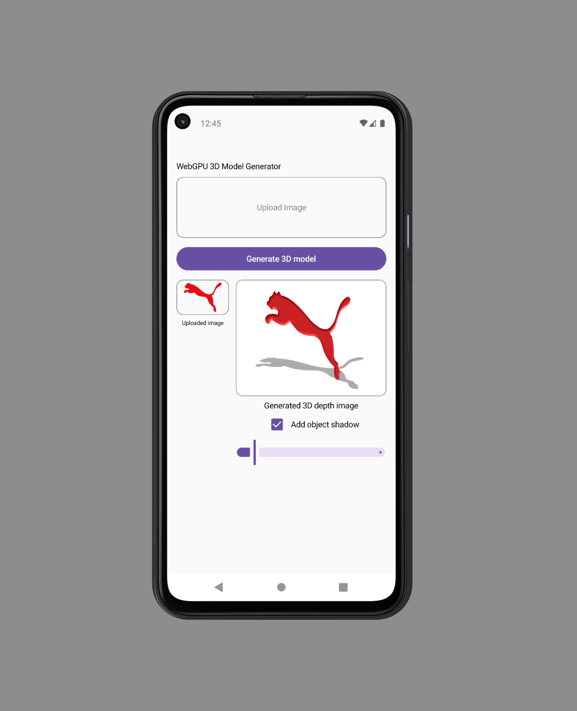

# Generate image 3D modelling using WebGPU in Jetpack Compose

An Android (Jetpack Compose) sample app that turns a flat image into a lit, 3D looking relief using [`androidx.webgpu`](https://developer.android.com/jetpack/androidx/releases/webgpu) Android's native WebGPU/Dawn bindings.

Experience the app [here](https://github.com/mikkelofficial7/android-webgpu-sample/raw/refs/heads/main/app-release.apk)

Pick an image, generate a relief-shaded "3D model" from it on the GPU, spin it with a slider, and optionally drop a shadow beneath it.

<p align="left">
  
</p>

## Features

- **Image upload** — pick any photo from the device gallery via the system photo picker.
- **GPU-rendered 3D relief** — the uploaded bitmap is rendered through a custom WebGPU pipeline that fakes depth using a generated height/relief map and per-pixel normal-mapped lighting (diffuse + specular), so a flat image reads as an embossed 3D object.
- **User-controlled 360° rotation** — a slider drives the object's `rotationY` directly (no auto-spin); dragging it rotates the rendered object in place.
- **Toggleable object shadow** — a checkbox renders a tinted silhouette shadow beneath the object, tilted onto the "ground" and scaled to approximate how its footprint would narrow/widen as it turns.
- **Transparent WebGPU background** — the render surface's clear color and alpha compositing are configured so the GPU content composites over the rest of the UI instead of painting an opaque backdrop.

## How the 3D effect works

1. **Height map generation** (`WebGpuRenderer.createHeightMap`): built from the source bitmap.
   - If the bitmap has real transparency (e.g. a cutout PNG), its **alpha channel** is used as the silhouette.
   - Otherwise (e.g. an opaque photo from the gallery), **luminance** is used instead — brighter pixels bulge toward the viewer, darker pixels recede.
   - The result is smoothed with a few passes of box blur so hard edges round off into a dome instead of a flat plateau.
2. **Upload to GPU**: the color bitmap is uploaded as an `RGBA8Unorm` texture; the height map as a single-channel `R8Unorm` texture.
3. **Fragment shader relief shading**: the shader samples four neighboring texels of the height map to reconstruct a per-pixel surface normal, then applies simple directional (diffuse) lighting plus a Blinn-Phong specular highlight — important for fully black/solid-colored source images, where diffuse shading alone would be invisible.
4. **Compose integration** (`WebGpuLoader.kt`): the renderer draws into an `AndroidEmbeddedExternalSurface` (TextureView-backed, not a `SurfaceView`), so the rendered content participates in normal Compose view compositing — including `graphicsLayer` transforms like `rotationY`, alpha, and clipping — unlike a `SurfaceView`-backed surface, which would ignore them.

## Project structure

```
app/src/main/java/com/jetpack/compose/sample_webgpu/
├── MainActivity.kt      # Compose UI: image picker, rotation slider, shadow toggle
├── WebGpuLoader.kt       # Bridges Compose to the WebGPU renderer via AndroidEmbeddedExternalSurface
├── WebGpuRenderer.kt     # WebGPU pipeline: texture upload, height-map generation, shader, render loop
└── ext/StringExt.kt      # Hex string -> GPUColor helper
```

## Requirements
- Android Studio (Narwhal or newer recommended)
- A device or emulator running **Android 8.0 (API 26)+**
- A Vulkan-capable GPU/driver is strongly recommended. On adapters without real alpha-compositing support (e.g. the SwiftShader software adapter some emulators fall back to), the renderer still runs but the background may stay opaque instead of transparent, since the surface's supported `CompositeAlphaMode`s are queried and the best available one is used automatically.

## Dependency
```
dependencies {
    implementation "androidx.webgpu:webgpu:1.0.0-alpha06"
}
```

## Building & running
```bash
./gradlew :app:assembleDebug
```

Or open the project in Android Studio and run the `app` configuration on a connected device/emulator.

## Tech stack
- [Jetpack Compose](https://developer.android.com/jetpack/compose) (Material 3)
- [`androidx.webgpu`](https://developer.android.com/jetpack/androidx/releases/webgpu) (Dawn-backed WebGPU bindings)
- [Coil](https://coil-kt.github.io/coil/) for async image loading
- Kotlin Coroutines

## Reference
[Getting started with WebGPU](https://developer.android.com/develop/ui/views/graphics/webgpu/getting-started?hl=id)
